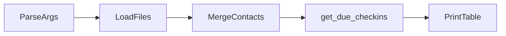

# Clique check-in CLI

Small **stdlib-only** Python tool that reads member and contact data from CSV/JSON, scores who is due for a check-in, and prints a sorted table. Uses **`unittest`** for tests (no pytest required).

## Requirements

- **Python 3.10+** (type syntax `list[str]`, `X | Y`).

## Run the CLI

From the project root (so paths resolve correctly):

```bash
python main.py
```

Optional arguments:

| Flag | Description |
|------|-------------|
| `--top N` | Maximum rows to print (default **5**; must be ≥ 1). |
| `--mock-date YYYY-MM-DD` | Use this calendar date as “today” instead of the current **UTC** date. |
| `--data-dir PATH` | Directory containing the data files (default **`data`**). |

Examples:

```bash
python main.py --top 3 --mock-date 2025-11-06
python main.py --data-dir data
```

The program expects:

- `members.csv`
- `last_contacts.csv`
- `holidays.json`

inside the data directory (see the sample files under `data/`).

## How it works (end to end)

1. **Parse CLI and pick the run date** — `parse_args` reads `--top`, `--mock-date`, and `--data-dir`. The calendar date used for all logic is either `--mock-date` or **today in UTC** (`datetime.now(timezone.utc).date()`).

2. **Load inputs** — From the data directory: `members.csv` (member profiles), `last_contacts.csv` (latest contact per member), and `holidays.json` (holiday dates).

3. **Merge contacts into members** — For each member, if their `member_id` appears in the contacts data, attach `last_contact_utc` and `last_outcome`; otherwise leave those fields unset (no merged contact row).

4. **Build the due list** — `get_due_checkins` runs on the merged list and the chosen date:
   - If that date is a **holiday**, the result is **empty** (no rows).
   - Otherwise keep members who pass the due rules: non-blank `preferred_channel`, and either **no** last contact or **at least seven** full calendar days since the last contact’s **UTC date**.
   - For each surviving member, compute a **priority score**, then sort by **priority descending** and **`member_id` ascending**, and take the first **`--top`** rows.
   - Each row gets a **recommended window**: morning if age ≥ 80, otherwise afternoon.

5. **Print** — A fixed-width table is written to stdout: `member_id`, `full_name`, `priority_score`, `recommended_window`.

Finer points (ISO timestamps with `Z`, duplicate contact rows, no-contact scoring, invalid `age`, and CSV details) are spelled out under [Assumptions and behavior](#assumptions-and-behavior) below.



## Run tests

```bash
python -m unittest test_main
```

Verbose:

```bash
python -m unittest test_main -v
```

## Assumptions and behavior

**“Today” without `--mock-date`:** the run date is **`datetime.now(timezone.utc).date()`** (calendar date in UTC). Use `--mock-date` for reproducible runs or scenarios (for example, aligning with fixed sample contacts).

**Last contact time (`last_contact_utc`):** instants are parsed as ISO-8601; a trailing **`Z`** is treated as UTC. For scoring and day gaps, the **UTC calendar date** of that instant is used (consistent with `...Z` in CSV).

**No contact history:** if a member has no merged contact row, they **can still qualify** for “due” (treated as an open gap for the 7-day rule). For **priority scoring only**, the fractional term uses a **365-day** synthetic gap so scores stay finite and comparable; the **`no_answer` outcome bonus does not apply** without a contact record.

**Duplicate `member_id` in `last_contacts.csv`:** the row with the **latest** `last_contact_utc` is kept.

**Holidays:** `holidays.json` is a JSON array of `YYYY-MM-DD` strings. If the **current run date** (mock or UTC “today”) equals any loaded holiday, **no one** is listed as due that day.

**Due rules (all must pass):** non-blank `preferred_channel` (after strip); either no last contact or **at least 7** full calendar days since the UTC contact date; and the run date is **not** a holiday.

**Priority:** integer bonuses (risk flags, age ≥ 80, `no_answer` when a contact exists) plus **`days_since_last_contact / 7`** (or **365/7** when there is no contact, for the fraction only). Results are sorted by **priority descending**, then **`member_id` ascending** (string order).

**CSV parsing:** `members.csv` uses **`;`**-separated `risk_flags`; empty cells are allowed. Invalid or non-integer `age` rows raise **`ValueError`**.
